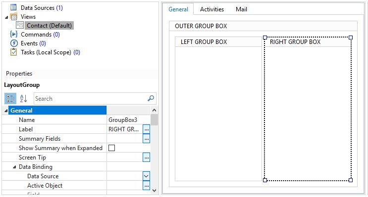

## Exercise 3 - Forms

####1. Create a Form: «Contact»

You will now make a Form for registering and opening customer Contact information.
1. In Studio, navigate to User Interface -> Forms. Right-click -> New -> Desktop Form. Save it right away with name «Contact».
2. Data Sources (upper-left corner): This is where you add the object(s) that you want to show or utilize in the Form. Add «Contact» as a Data Source (see screenshot below). Note that:
   1. Data Source «Contact» has to be "public". Hence, uncheck the property named Private. The reason is that you want to be able to filter a Contact-object into the form (i.e. input an object to the Form, so that the form knows which contact person to show).
   2. Data Source «Contact» must be set to «Max Occurences» = "One", which means that only one Contact-object can exist in the Form. This has to be done in order to allow the properties of Contact to be shown in fields. "Unbound" is used for data sources that you want to list (e.g. in a Grid, Table, etc).
   3. This form will be used as the "master" form for showing Contacts, i.e. you can use it as the default form for showing a Contact. Hence, check the «Is Master» property.

3. Views: Go to View (Default). Change the name to «Contact».
4. Add Container «Tab Sheets». Click inside the first tab to mark the Group it contains. Change the name to "General".
  Add a new tab: Move one level out (hint: press the Esc-button), and double-click on "Group" in the Desktop Control menu. Name the new tab «Activities» (content will come later). 
  Add also a tab named «Mail» to the Tab Sheet (content will come later).
5. In tab «General», you will add the fields for Contact.
   *Guidance: You will be asked to model a «Contact log» at the right hand side of this display in an upcoming task. Hence, we recommend the following layout for the «General»-tab:*

   
   Select OUTER GROUPBOX (or whatever you called it in your solution) and change «Container Type» to «Group» in the menu on the left. This will remove the frame of the box. Do the same for LEFT GROUPBOX and RIGHT GROUPBOX. Fields can be dragged from the right menu and dropped into the form after changing the following:
   

  
   After having made the change above, you can drag Data Properties from the Contact data source into the Groups located in the «General»-tab. A proposed layout control is selected by default (e.g. TextEdit is proposed for «First Name»). If you drag Company into the form, a ComboBoxEdit - which is a dropdown - is suggested. This may be unfortunate when there are a lot of objects to choose from. Instead you can press Shift while dragging the Company into the form, and you will get a SearchBoxEdit rather than a ComboBoxEdit - increasing the user friendliness.

<table>
   <tr><td><a href="exercise-02-2.md"><- Previous</a></td><td align="right"><a href="exercise-03-2.md">Next -></a></td></tr>
</table>
