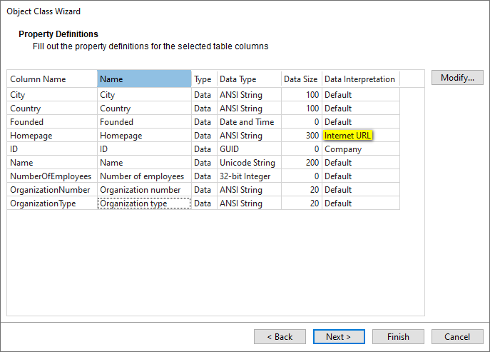
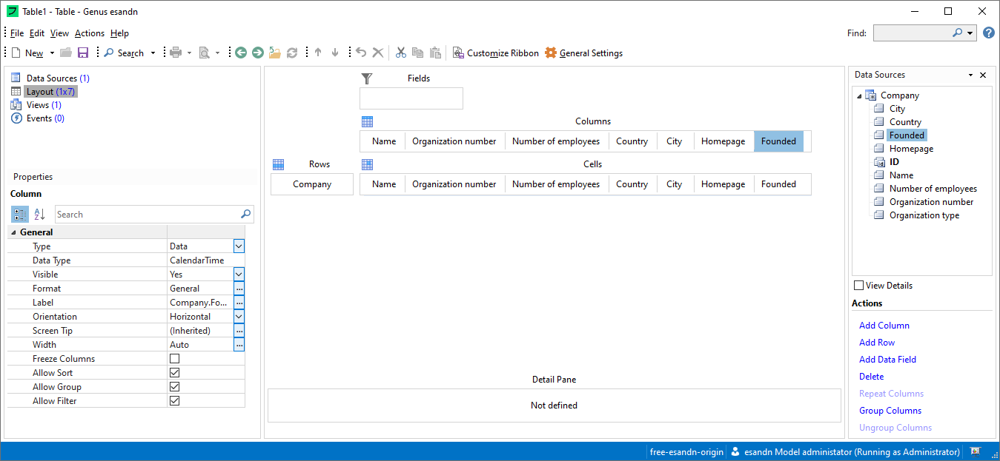
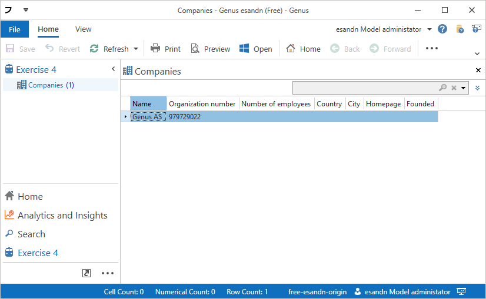
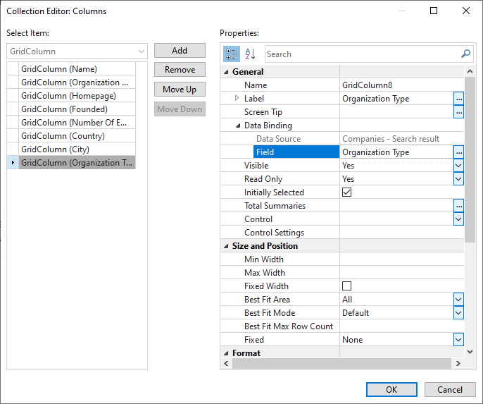
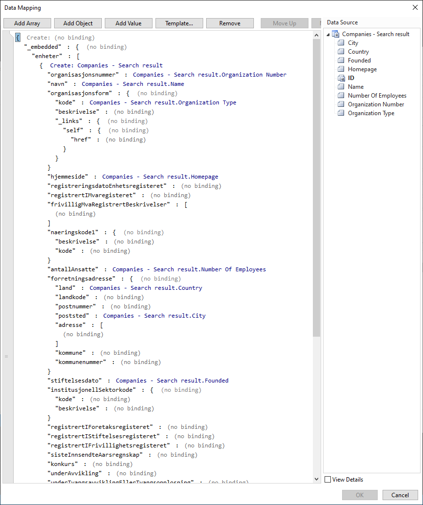
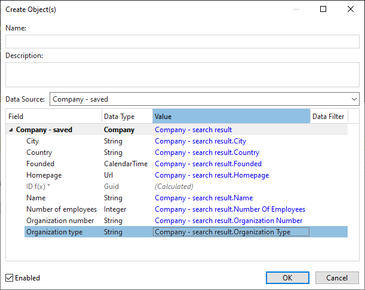
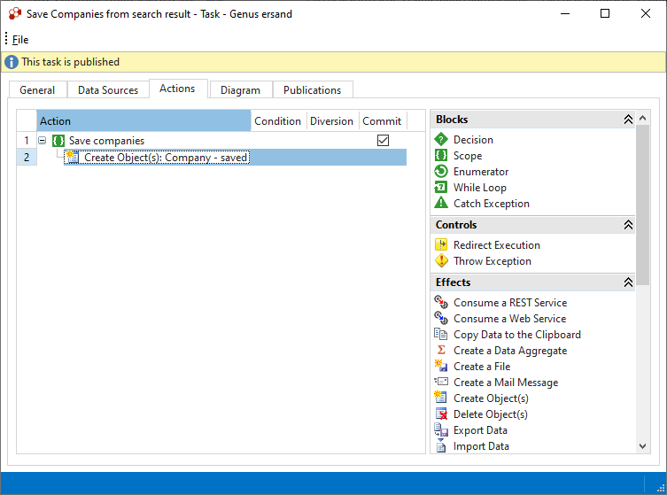
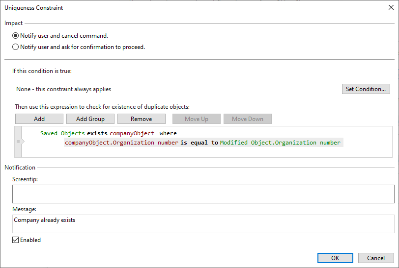
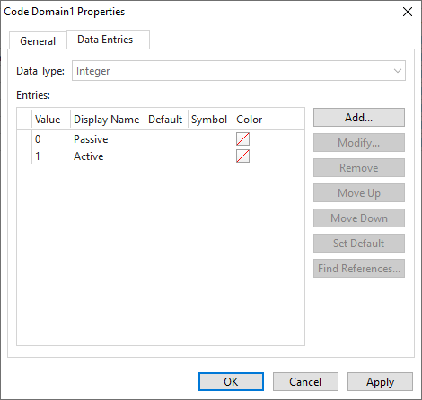

## Exercise 4 - Introduction to Genus Desktop 

This is a step-by-step tutorial on how to use different concepts in the Genus platform in a simple app model for Genus Desktop.

####1. Create an Object Class - Company

Create your first object class, Company.

1. Create a database table for storage of data in the Object Class, run the following SQL in SSMS.
 ```sql
 create table Company
 (
   ID uniqueidentifier primary key,
   Name nvarchar (200),
   OrganizationNumber varchar (20),
   Homepage varchar (300),
   OrgType varchar (20),
   NoOfEmployees int,
   Country varchar (100),
   City varchar (100),
   FoundedDate datetime,
   CreatedByUserId uniqueidentifier,
   CreatedDate datetime,
   LastModifiedByUserId uniqueidentifier,
   LastModifiedDate datetime
 )
 go
 
 insert into Company ( ID, Name, OrganizationNumber) values ( NEWID (), 'Genus AS' , '979729022' )
 go
 ```
2. Create the Object Class for Company. In Genus Studio | Object Classes, select New -\&gt; Object Domain.
  1. Next – Use default settings
  2. Select the new Company table from the list
  3. Next – Keep all columns
  4. Select Company.ID as the primary key and check &quot;Generate identifier automatically&quot;. Click Next.
  5. Set up the Name and Data Interpretation for the properties as shown in the screenshot. Click Next when completed.
 
  6. Add the property Name as Object Class naming. Click Finish.
  7. Find the Object Class and expand Company to show the properties.
  8. For the following properties, open and go to Data Calculation
    1. Created by – Default: Active User Account Stamp
    2. Created – Default: Time Stamp
    3. Last modified by – Formula: Active User Account Stamp
    4. Last modified – Formula: Time Stamp

_Default will set the value when the object is created, Formula will update the value every time the object is modified._

####2. Create a Table for Company

Navigate to User Interface | Desktop | Tables in Genus Studio

1. Select New -\&gt; Basic Table
2. In Data Sources, Add -\&gt; Object, select Company and click OK.
3. Go to Layout, drag Company from the right-hand pane on to Rows.
4. Expand the Data Source, drag or double click on properties to add them to the table layout.
 
5. Navigate to Views, rename the view to e.g. Companies.
6. Save the table with an appropriate name, e.g. Companies.
7. Navigate to Genus Studio | User Interface | Desktop | Navigation Pane, Right click in the page and select Add View Button. Give it an appropriate name.
8. Right click on the new entry and select Properties.
  1. In the Security tab, select Add
  2. Click Advanced and Add Groups
  3. Select the security group Standard and click OK (three times)
  4. For the new addition (Standard) check the Permissions
    1. Find and List
    2. Read and Execute
  5. Click OK
9. Right click on the new entry and select Add Shortcut.
  1. Select Table and Next
  2. In Target, click Browse and select the previously created table. Click Next
  3. Select a Symbol, click Change and find a suitable one.
  4. Click Finish.
10. Start/restart Genus Desktop and navigate to the new table.
 

####3. Create a form for searching in Brønnøysundregisteret

1. In Genus Studio, navigate to Object Classes, add New -\&gt; Object Domain
  1. Set Data Provider = None, click Next
  2. Select the database table Company, rename to Company (brreg), click Next
  3. Remove the columns, CreatedByUserId, CreatedDate, LastModifiedByUserId, LastModifiedDate. Click Next.
  4. Select ID as primary key, and check Generate identifier automatically. Click Next
  5. Give appropriate names to fields
  6. Finnish
2. In Genus Studio, navigate to User Interface | Desktop | Forms and create a new Form.
3. Go to Data Sources and add a Local Object, rename to UI
  1. Rename to UI
  2. Go to Data Filter, click on the three dots and select Create single object
  3. Add one Field, rename to Search
4. Add another Data Source, select Object… and select Company (brreg)
  1. Rename to Companies – Search result
  2. Deselect Persistable
5. Select the default view
  1. Switch Style to Dialog Box
6. Add two parallel Group Boxes to the main view, use Esc to traverse back to the top level.
7. Select the top Group Box
  1. In the right pane, switch view to Data Sources, double click or drag Search from UI.
  2. Switch back to Desktop Controls and add a Symbol, select a symbol for search. Switch to Type to Small Symbol.
8. Select the bottom Group Box and add a Grid.
  1. Select Companies – Search result as the Data Source
  2. Add desired columns to the Grid by clicking the three dots in Columns property
    1. Click Add and select the desired field
 
9. Select the top Group Box
  1. Set Orientation to Horizontal
  2. Deselect Show Title
  3. Set Vertical Alignment to Top
10. Select the bottom Group Box
  1. Deselect Show Title
11. Save as &quot;Search in Brønnøysundregisteret&quot;
12. Open the table Companies
13. Go to Events, right click and New -\&gt; Open a Form
  1. Effect – Select the new Form
  2. Name – Search
  3. Screen Tip - Search in Brønnøysundregisteret
  4. Symbol – Search
14. Click Customize Ribbon
  1. In the Right drop down, Switch to Main Tabs (_Ribbon for inline Desktop elements)_
  2. Right click on Home, select Add Tab Section
  3. Double click on new Tab Section and rename to Search
  4. Switch left drop down to Table Commands, drag the new command into to the new tab section.
15. Close Ribbon editor.
16. Save and close table.
17. Start/restart Genus Desktop (ctrl+shift+F5 to restart).
18. Check that the new form can be opened from the table.

####4. Integrate with API from Brønnøysundregisteret

1. Open the form Search in Brønnøysundregisteret
2. Go to Actions (Local Scope)
3. Add new Action &quot;Search&quot;
4. Go to Actions
5. Add Decision
  1. Double click on the new Decision
  2. Rename to Clear DS
  3. Click on Set Condition…
  4. Add decision &quot;Companies – Search result _has value_&quot;
  5. Close
6. Drag as Read Object(s) onto the decision (or double click on the effect while Clear DS is active)
  1. Double click
  2. Select Companies – Search result as Data Source
  3. Leave Data Filter as is (No objects – clears the data source)

_This will clear previous search results from the data source_

7. Add a new effect outside the decision, Consume a REST Service
  1. Paste the url ```https://data.brreg.no/enhetsregisteret/api/enheter?navn=``` into URL
  2. At the end of this URL, right click and select Field. Add the field Search from the local object UI
 
  3. In Response Handlers, click Add
    1. Expected Format: JSON
    2. Import Format: JSON
    3. Data Source: Companies – Search result
  4. Click Customize, then Template…, then Test REST Request
  5. Paste the URL ```https://data.brreg.no/enhetsregisteret/api/enheter?navn=genus``` and click Send
  6. Copy the Response Body, click Close
  7. Paste the Response Body into Json Data, and click OK, select Yes when prompted
  8. Drag &quot;Companies – Search result&quot; onto Create: (no binding) below the element &quot;enheter&quot;
  9. Drag the appropriate fields onto the corresponding elements
    1. organisasjonsnummer – Organization number
    2. navn – Name
    3. organisasjonsform -\&gt; kode - Organization type
    4. hjemmeside – Homepage
    5. antallAnsatte – No of employees
    6. forretningsadresse -\&gt; land – Country
    7. forretningsadresse -\&gt; poststed - City
    8. siftelsesdato – Founded
    9. konkurs – Bankrupt
 
8. Click OK, three times back to the Action editor
9. Click Ok to close the Action
10. Right click on the Action and select properties, go to Security
  1. Add Everybody
  2. Check the two top permissions.
11. Go to Commands and add New - \&gt; Run a Action (local scope)
  1. Control: Form
  2. Effect: Seach
  3. Symbol: Search
  4. Enabled: Select enter a condition
    1. Left operand: select UI.Search, and Apply function LENGTH
    2. is greater than
    3. Right operand: enter a number, input 3
12. Navigate to the View editor, click on the search symbol, and click the three dots in Events.
  1. Select Add
  2. Type: On Click
  3. Command: Search (Form)
  4. Click OK
13. Click on the Search TextEdit field.
  1. Add Event with type On Enter Key Pressed with the same command.
  2. OK
14. Save and close form
15. Start/restart Genus Desktop and test. (ctrl+shift+F5 to restart Genus Desktop)

####5. Add a Action to save Companies from Search Result

1. In Genus Studio, navigate to Logic | Actions
2. Create a new Action, Save Companies from search result
3. Add a data source, right click -\&gt; Add -\&gt; Object -\&gt; Company
  1. Rename to Company – search result
  2. Max occurrences = Unbounded
  3. Select Cannot be blank
  4. Deselect Private
  5. Deselect Persistable
4. Add a data source, right click -\&gt; Add -\&gt; Object -\&gt; Company
  1. Rename to Company – saved
  2. Max occurrences = Unbounded
5. Go to Actions tab
  1. Add a Scope, open
    1. Rename to Save companies
    2. Check Disable Live Update
  2. Inside Scope, add a Create Object(s)-effect, open
    1. Set Data Source to Company – saved
    2. On top level, bind Company – search result
    3. On each property, bind corresponding property. (Tip use F5 to select property)
 
  3. The Action should now look like this
 
  4. Save and close the Action
  5. Right click on the new Action and add Security (Standard security group, top two permissions)
6. Open the search form
7. Add a command on the Form, Run a Action (Global Scope), and select the new Action
  1. Open Filter Data
    1. Double Click on Company – Search result (or click modify)
    2. Select &quot;One-way binding,,,&quot;, click Modify
    3. Select Companies – Search result (form data source) in first drop down
    4. Select Selected in second drop down
    5. Click OK back to Form editor
  2. Select Conditional… in Enabled,
    1. Right click on left operand and select Active object selection
    2. Group: Companies – Search result
    3. Selection: Selected objects
    4. Click OK
    5. The condition should now be &quot;Companies – Search result.Selected Objects _has value&quot;_
    6. Click OK
8. Go to View editor and add a Button somewhere appropriate.
  1. Give the button a label. If necessary, remove the 75px width constraint
  2. Add an Event, On Click, and select the new command
9. Save and close the form
10. Navigate to Data -\&gt; Object Classes -\&gt; Company
  1. Open (double click Company)
  2. Go to Data Integrity, click change on Uniqueness Constraint
  3. Click Add, and setup this constraint
 
  4. Click OK back to Genus Studio main window
11. Start/restart Genus Desktop and test (ctrl+shift+F5 to restart Desktop)
12. Test that saving the same company twice is not possible.

####6. Improve Action to update existing companies

1. Open the Action again
2. Add a Read object(s)-effect above the existing scope, setup:
 
3. Add a Modify Object(s) effect inside the scope
  1. Data Source: Company – saved
  2. Doble click on top level
    1. Value Company – search result
  3. Bind Company – search result at top level
  4. Set up data binding on Organization number
 
  5. Click OK
  6. Bind all other properties, except Organization number
 
  7. Click OK
4. Open the existing Create object(s) effect
  1. Double click on the top level
  2. Set the Data Binding to
 
5. Save the Action
6. Test by searching for Genus and saving this Company.

_NOTE: Small issue with the updated object appearing in the search result, this is due to reuse of the Company object as the object to receive data from Brønnøysund. Normally a dedicated object for integration and a separate object for app model usage is recommended._

####7. Setup Search for Company

1. Open the Company object class
  1. Go to Search
  2. Modify Search properties
  3. Add Name, Organization Number and some others. Check Generic Search for Name and Organization number.
2. Go to the Table
  1. Navigate to the view
  2. Go to Search
  3. Check Enable Search
  4. In Data Sources, add Company
3. Save, restart and test

####8. Create a Code Domain for Company State

1. Create a Code Domain for Company State. In Genus Studio | Object Classes, select New -\&gt; Code Domain. Name the Code Domain &quot;Company State&quot; and add the values below. Click OK.
  
2. Add a new column to the database table Company
 ```sql
 alter table Company
 add StateId int
 go
 
 update Company
 set StateId = 1
 go
 ```
3. On the object class Company, right click and select &quot;Add object class properties&quot;
4. Select the new column and set interpretation to the new Code Domain.


<table>
 <tr>
  <td><a href="exercise-03.md"><- Previous</a></td>
  <!--<td align="right"><a href="exercise-05.md">Next -></a></td>-->
  </tr>
</table>